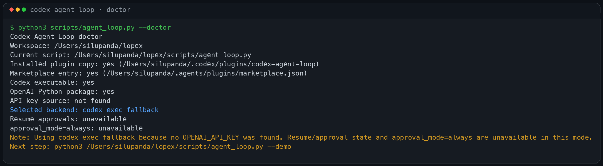

# Codex Agent Loop

A local Codex plugin that gives Codex a Claude-Code-style loop runner for bounded coding tasks.

GitHub: https://github.com/SiluPanda/codex-agent-loop

## 60-second quickstart

### 1) Install it

Clone anywhere, then run the installer:

```bash
git clone https://github.com/SiluPanda/codex-agent-loop.git
cd codex-agent-loop
python3 scripts/install.py
```

The installer:

- copies the plugin into `~/.codex/plugins/codex-agent-loop`
- merges the marketplace entry into `~/.agents/plugins/marketplace.json`
- backs up the previous marketplace file if one exists

### 2) Check your setup

```bash
python3 ~/.codex/plugins/codex-agent-loop/scripts/agent_loop.py --doctor
```

This tells you:

- which backend will run
- whether `OPENAI_API_KEY` was found
- whether resume/approval-state is supported
- whether Codex and the marketplace entry are installed correctly

### 3) Get your first success

Run the guided demo:

```bash
python3 ~/.codex/plugins/codex-agent-loop/scripts/agent_loop.py --demo
```

This first demo is safe and read-only.

### 4) Run a real task

```bash
python3 ~/.codex/plugins/codex-agent-loop/scripts/agent_loop.py \
  --max-turns 8 \
  --approval-mode on-write \
  "Fix the failing tests and verify the result"
```

## What success looks like

You should see:

- a backend banner
- a status summary
- a run directory like `~/.codex/agent-loop/runs/<timestamp>-<id>/`

## Friendly approval modes

- `safe` = `on-write` (default)
- `hands-off` = `never`
- `review-everything` = `always`

The CLI flags stay:

- `--approval-mode on-write`
- `--approval-mode never`
- `--approval-mode always`

## Preview

Animated write-flow demo:


CLI help:


Doctor output:



Read-only inspection example:


Write example:


## What it includes

- `/agent-loop` command
- `codex-agent-loop` skill
- `scripts/agent_loop.py` runner
- `scripts/install.py` installer
- `--doctor` environment check
- `--demo` onboarding run
- local run logs and resumable approval state

## Backends

### 1) OpenAI Responses API

Used when an API key is available.

Supports:

- multi-turn tool loops
- resumable approval state
- `approval_mode=always`

### 2) `codex exec` fallback

Used when no API key is available but Codex is installed and authenticated.

Supports:

- normal loop execution
- model selection
- reasoning effort selection
- ChatGPT-authenticated Codex installs

Limitations:

- `approval_mode=always` is unavailable
- `--resume ... --approve-pending` is unavailable

## Common commands

### Setup diagnosis

```bash
python3 scripts/agent_loop.py --doctor
```

### Guided demo

```bash
python3 scripts/agent_loop.py --demo
```

### Read-only inspection

```bash
python3 scripts/agent_loop.py \
  --max-turns 3 \
  --approval-mode on-write \
  "Inspect this workspace and report what files exist. Do not modify anything."
```

### Tiny write demo

```bash
python3 scripts/agent_loop.py \
  --approval-mode never \
  --cwd /tmp/codex-agent-loop-demo \
  "Create a file named hello.txt containing exactly hello from codex-agent-loop."
```

### JSON output

```bash
python3 scripts/agent_loop.py --json "Summarize this repo"
```

## Docs

- [Troubleshooting](docs/troubleshooting.md)
- [Architecture](docs/architecture.md)
- [Development](docs/development.md)
- [Manual install](docs/manual-install.md)

## Repo layout

```text
.codex-plugin/plugin.json
commands/agent-loop.md
docs/
scripts/agent_loop.py
scripts/install.py
skills/codex-agent-loop/SKILL.md
tests/
```
