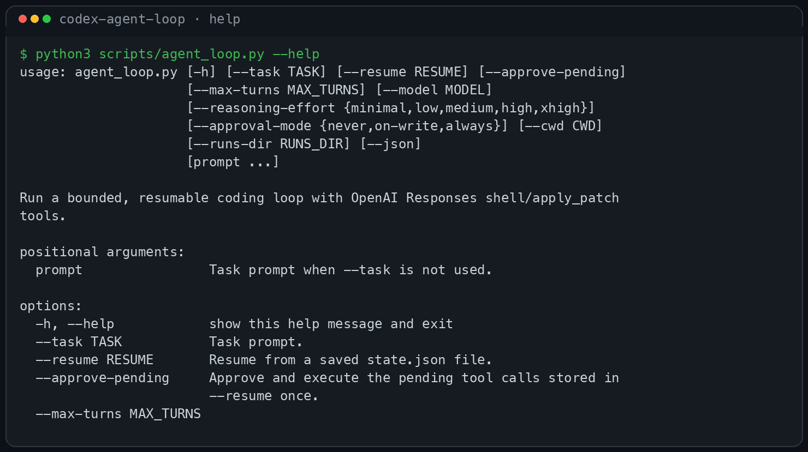
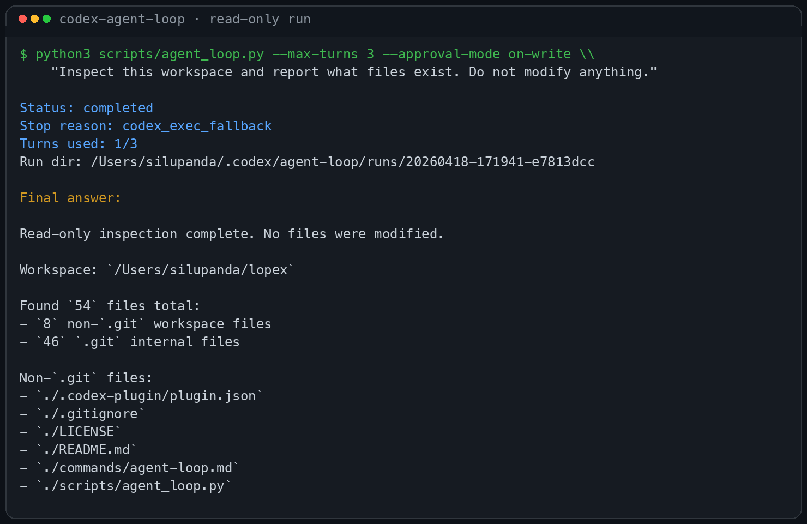
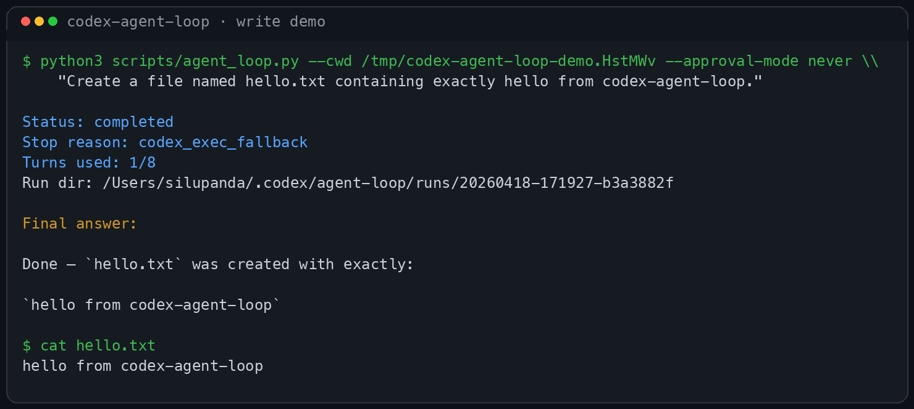

# Codex Agent Loop

A local Codex plugin that gives Codex a Claude-Code-style loop runner for bounded coding tasks.

GitHub: https://github.com/SiluPanda/codex-agent-loop

## Preview

Animated write-flow demo:


CLI help:



Read-only inspection example:



Write example:



It ships with:

- a `/agent-loop` command
- a `codex-agent-loop` skill
- a reusable Python runner
- local run logs and resumable approval state

The primary backend uses the OpenAI Responses API with `shell` and `apply_patch` tools. If `OPENAI_API_KEY` is not available, it automatically falls back to `codex exec`, so it still works with a ChatGPT-authenticated Codex install.

## Features

- bounded loop execution with `--max-turns`
- approval controls with `--approval-mode`
- model selection with `--model`
- reasoning control with `--reasoning-effort`
- resumable approval pauses in Responses API mode
- local logs under `~/.codex/agent-loop/runs/`

## Repo layout

```text
.codex-plugin/plugin.json
commands/agent-loop.md
skills/codex-agent-loop/SKILL.md
scripts/agent_loop.py
tests/test_agent_loop.py
```

## Installation

### Option 1: personal Codex plugin install

Copy or clone this repo into:

```bash
~/.codex/plugins/codex-agent-loop
```

Example:

```bash
git clone https://github.com/SiluPanda/codex-agent-loop.git \
  ~/.codex/plugins/codex-agent-loop
```

Then add it to your personal marketplace file:

```json
{
  "name": "my-local-plugins",
  "interface": { "displayName": "My Local Plugins" },
  "plugins": [
    {
      "name": "codex-agent-loop",
      "source": {
        "source": "local",
        "path": "./.codex/plugins/codex-agent-loop"
      },
      "policy": {
        "installation": "AVAILABLE",
        "authentication": "ON_INSTALL"
      },
      "category": "Coding"
    }
  ]
}
```

Save that as:

```bash
~/.agents/plugins/marketplace.json
```

Then restart Codex and install/enable the plugin from `/plugins`.

### Option 2: run the loop runner directly

You can also run the script directly from this repo:

```bash
python3 scripts/agent_loop.py --help
```

## Usage

### Basic

```bash
python3 scripts/agent_loop.py \
  --max-turns 8 \
  --approval-mode on-write \
  --model gpt-5.4 \
  --reasoning-effort high \
  "Fix the failing tests and verify the result"
```

### Read-only inspection

```bash
python3 scripts/agent_loop.py \
  --max-turns 3 \
  --approval-mode on-write \
  "Inspect this workspace and report what files exist. Do not modify anything."
```

### Allow writes without pausing

```bash
python3 scripts/agent_loop.py \
  --approval-mode never \
  "Create a file named hello.txt containing exactly hello from codex-agent-loop."
```

### JSON output

```bash
python3 scripts/agent_loop.py --json "Summarize this repo"
```

## Approval modes

- `on-write` (default): auto-run read-only shell commands, pause before write-like shell commands and patches
- `always`: pause before every shell command and every patch
- `never`: never pause; execute all tool calls automatically

## Resuming a paused run

If the Responses backend pauses for approval, resume it with:

```bash
python3 scripts/agent_loop.py \
  --resume ~/.codex/agent-loop/runs/<run-id>/state.json \
  --approve-pending
```

Each run stores a `state.json` file in its run directory.

## Auth behavior

The runner tries, in order:

1. `OPENAI_API_KEY` from the environment
2. `~/.codex/auth.json`
3. fallback execution through `codex exec`

## Backend modes

### 1) OpenAI Responses backend

Used when an API key is available.

Supports:

- multi-turn tool loops
- resumable approval state
- shell tool execution
- patch application via `apply_patch`

### 2) `codex exec` fallback backend

Used when no API key is available but Codex is installed and authenticated.

Supports:

- normal one-shot loop-style execution
- model selection
- reasoning effort selection
- direct use with a ChatGPT-authenticated Codex install

Limitations:

- `approval_mode=always` is not supported
- `--resume ... --approve-pending` is not supported
- approval behavior is best-effort prompt guidance rather than host-enforced tool gating

## Slash command and skill

After installation, the plugin provides:

- `/agent-loop`
- `codex-agent-loop` skill

Example prompts:

- “Run an agent loop on this task with an 8-turn cap.”
- “Iterate until the bug is fixed, but pause before write actions.”
- “Resume the last paused coding loop and approve the pending patch.”

## Output and logs

Run artifacts are stored in:

```bash
~/.codex/agent-loop/runs/<timestamp>-<id>/
```

Typical contents:

- `state.json`
- `responses.jsonl`
- `events.jsonl`
- `codex_exec.stdout.jsonl`
- `codex_exec.stderr.txt`

## Development

Run the tests:

```bash
python3 -m unittest discover -s tests -p 'test_*.py'
```

Check syntax:

```bash
python3 -m py_compile scripts/agent_loop.py tests/test_agent_loop.py
```

## Notes

- This plugin is intentionally Claude-Code-like in workflow, not Anthropic-SDK-compatible.
- The fallback backend is designed to keep the plugin useful even when Codex is authenticated without an API key.
